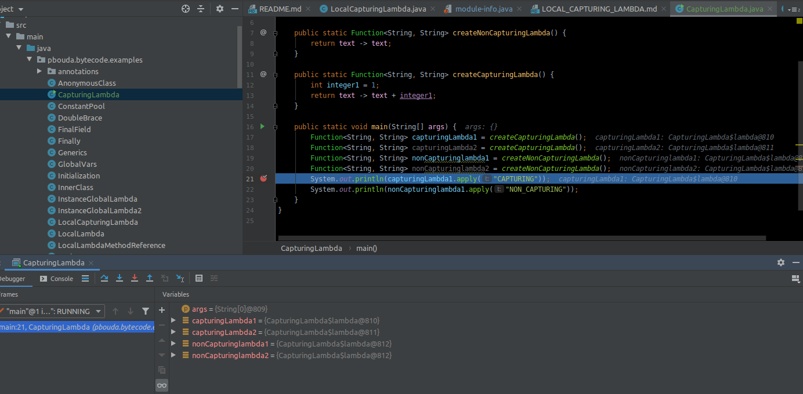

# Local Capturing Lambda

- When the lambda needs to keep context then it generates a new instance for every invocation. 




```
javap -v -p target/classes/pbouda/bytecode/examples/CapturingLambda.class
Classfile /home/pbouda/experiments/bytecode-practise/examples/target/classes/pbouda/bytecode/examples/CapturingLambda.class
  Last modified Nov 14, 2019; size 2567 bytes
  MD5 checksum 9379151327004e0c7cefb0ced5b04a10
  Compiled from "CapturingLambda.java"
public class pbouda.bytecode.examples.CapturingLambda
  minor version: 0
  major version: 54
  flags: (0x0021) ACC_PUBLIC, ACC_SUPER
  this_class: #13                         // pbouda/bytecode/examples/CapturingLambda
  super_class: #14                        // java/lang/Object
  interfaces: 0, fields: 0, methods: 6, attributes: 3
Constant pool:
    #1 = Methodref          #14.#48       // java/lang/Object."<init>":()V
    #2 = InvokeDynamic      #0:#54        // #0:apply:()Ljava/util/function/Function;
    #3 = InvokeDynamic      #1:#56        // #1:apply:(I)Ljava/util/function/Function;
    #4 = Methodref          #13.#57       // pbouda/bytecode/examples/CapturingLambda.createCapturingLambda:()Ljava/util/function/Function;
    #5 = Methodref          #13.#58       // pbouda/bytecode/examples/CapturingLambda.createNonCapturingLambda:()Ljava/util/function/Function;
    #6 = Fieldref           #59.#60       // java/lang/System.out:Ljava/io/PrintStream;
    #7 = String             #61           // CAPTURING
    #8 = InterfaceMethodref #62.#63       // java/util/function/Function.apply:(Ljava/lang/Object;)Ljava/lang/Object;
    #9 = Class              #64           // java/lang/String
   #10 = Methodref          #65.#66       // java/io/PrintStream.println:(Ljava/lang/String;)V
   #11 = String             #67           // NON_CAPTURING
   #12 = InvokeDynamic      #2:#70        // #2:makeConcatWithConstants:(Ljava/lang/String;I)Ljava/lang/String;
   #13 = Class              #71           // pbouda/bytecode/examples/CapturingLambda
   #14 = Class              #72           // java/lang/Object
   #15 = Utf8               <init>
   #16 = Utf8               ()V
   #17 = Utf8               Code
   #18 = Utf8               LineNumberTable
   #19 = Utf8               LocalVariableTable
   #20 = Utf8               this
   #21 = Utf8               Lpbouda/bytecode/examples/CapturingLambda;
   #22 = Utf8               createNonCapturingLambda
   #23 = Utf8               ()Ljava/util/function/Function;
   #24 = Utf8               Signature
   #25 = Utf8               ()Ljava/util/function/Function<Ljava/lang/String;Ljava/lang/String;>;
   #26 = Utf8               createCapturingLambda
   #27 = Utf8               integer1
   #28 = Utf8               I
   #29 = Utf8               main
   #30 = Utf8               ([Ljava/lang/String;)V
   #31 = Utf8               args
   #32 = Utf8               [Ljava/lang/String;
   #33 = Utf8               capturingLambda1
   #34 = Utf8               Ljava/util/function/Function;
   #35 = Utf8               capturingLambda2
   #36 = Utf8               nonCapturinglambda1
   #37 = Utf8               nonCapturinglambda2
   #38 = Utf8               LocalVariableTypeTable
   #39 = Utf8               Ljava/util/function/Function<Ljava/lang/String;Ljava/lang/String;>;
   #40 = Utf8               lambda$createCapturingLambda$1
   #41 = Utf8               (ILjava/lang/String;)Ljava/lang/String;
   #42 = Utf8               text
   #43 = Utf8               Ljava/lang/String;
   #44 = Utf8               lambda$createNonCapturingLambda$0
   #45 = Utf8               (Ljava/lang/String;)Ljava/lang/String;
   #46 = Utf8               SourceFile
   #47 = Utf8               CapturingLambda.java
   #48 = NameAndType        #15:#16       // "<init>":()V
   #49 = Utf8               BootstrapMethods
   #50 = MethodHandle       6:#73         // REF_invokeStatic java/lang/invoke/LambdaMetafactory.metafactory:(Ljava/lang/invoke/MethodHandles$Lookup;Ljava/lang/String;Ljava/lang/invoke/MethodType;Ljava/lang/invoke/MethodType;Ljava/lang/invoke/MethodHandle;Ljava/lang/invoke/MethodType;)Ljava/lang/invoke/CallSite;
   #51 = MethodType         #74           //  (Ljava/lang/Object;)Ljava/lang/Object;
   #52 = MethodHandle       6:#75         // REF_invokeStatic pbouda/bytecode/examples/CapturingLambda.lambda$createNonCapturingLambda$0:(Ljava/lang/String;)Ljava/lang/String;
   #53 = MethodType         #45           //  (Ljava/lang/String;)Ljava/lang/String;
   #54 = NameAndType        #76:#23       // apply:()Ljava/util/function/Function;
   #55 = MethodHandle       6:#77         // REF_invokeStatic pbouda/bytecode/examples/CapturingLambda.lambda$createCapturingLambda$1:(ILjava/lang/String;)Ljava/lang/String;
   #56 = NameAndType        #76:#78       // apply:(I)Ljava/util/function/Function;
   #57 = NameAndType        #26:#23       // createCapturingLambda:()Ljava/util/function/Function;
   #58 = NameAndType        #22:#23       // createNonCapturingLambda:()Ljava/util/function/Function;
   #59 = Class              #79           // java/lang/System
   #60 = NameAndType        #80:#81       // out:Ljava/io/PrintStream;
   #61 = Utf8               CAPTURING
   #62 = Class              #82           // java/util/function/Function
   #63 = NameAndType        #76:#74       // apply:(Ljava/lang/Object;)Ljava/lang/Object;
   #64 = Utf8               java/lang/String
   #65 = Class              #83           // java/io/PrintStream
   #66 = NameAndType        #84:#85       // println:(Ljava/lang/String;)V
   #67 = Utf8               NON_CAPTURING
   #68 = MethodHandle       6:#86         // REF_invokeStatic java/lang/invoke/StringConcatFactory.makeConcatWithConstants:(Ljava/lang/invoke/MethodHandles$Lookup;Ljava/lang/String;Ljava/lang/invoke/MethodType;Ljava/lang/String;[Ljava/lang/Object;)Ljava/lang/invoke/CallSite;
   #69 = String             #87           // \u0001\u0001
   #70 = NameAndType        #88:#89       // makeConcatWithConstants:(Ljava/lang/String;I)Ljava/lang/String;
   #71 = Utf8               pbouda/bytecode/examples/CapturingLambda
   #72 = Utf8               java/lang/Object
   #73 = Methodref          #90.#91       // java/lang/invoke/LambdaMetafactory.metafactory:(Ljava/lang/invoke/MethodHandles$Lookup;Ljava/lang/String;Ljava/lang/invoke/MethodType;Ljava/lang/invoke/MethodType;Ljava/lang/invoke/MethodHandle;Ljava/lang/invoke/MethodType;)Ljava/lang/invoke/CallSite;
   #74 = Utf8               (Ljava/lang/Object;)Ljava/lang/Object;
   #75 = Methodref          #13.#92       // pbouda/bytecode/examples/CapturingLambda.lambda$createNonCapturingLambda$0:(Ljava/lang/String;)Ljava/lang/String;
   #76 = Utf8               apply
   #77 = Methodref          #13.#93       // pbouda/bytecode/examples/CapturingLambda.lambda$createCapturingLambda$1:(ILjava/lang/String;)Ljava/lang/String;
   #78 = Utf8               (I)Ljava/util/function/Function;
   #79 = Utf8               java/lang/System
   #80 = Utf8               out
   #81 = Utf8               Ljava/io/PrintStream;
   #82 = Utf8               java/util/function/Function
   #83 = Utf8               java/io/PrintStream
   #84 = Utf8               println
   #85 = Utf8               (Ljava/lang/String;)V
   #86 = Methodref          #94.#95       // java/lang/invoke/StringConcatFactory.makeConcatWithConstants:(Ljava/lang/invoke/MethodHandles$Lookup;Ljava/lang/String;Ljava/lang/invoke/MethodType;Ljava/lang/String;[Ljava/lang/Object;)Ljava/lang/invoke/CallSite;
   #87 = Utf8               \u0001\u0001
   #88 = Utf8               makeConcatWithConstants
   #89 = Utf8               (Ljava/lang/String;I)Ljava/lang/String;
   #90 = Class              #96           // java/lang/invoke/LambdaMetafactory
   #91 = NameAndType        #97:#101      // metafactory:(Ljava/lang/invoke/MethodHandles$Lookup;Ljava/lang/String;Ljava/lang/invoke/MethodType;Ljava/lang/invoke/MethodType;Ljava/lang/invoke/MethodHandle;Ljava/lang/invoke/MethodType;)Ljava/lang/invoke/CallSite;
   #92 = NameAndType        #44:#45       // lambda$createNonCapturingLambda$0:(Ljava/lang/String;)Ljava/lang/String;
   #93 = NameAndType        #40:#41       // lambda$createCapturingLambda$1:(ILjava/lang/String;)Ljava/lang/String;
   #94 = Class              #102          // java/lang/invoke/StringConcatFactory
   #95 = NameAndType        #88:#103      // makeConcatWithConstants:(Ljava/lang/invoke/MethodHandles$Lookup;Ljava/lang/String;Ljava/lang/invoke/MethodType;Ljava/lang/String;[Ljava/lang/Object;)Ljava/lang/invoke/CallSite;
   #96 = Utf8               java/lang/invoke/LambdaMetafactory
   #97 = Utf8               metafactory
   #98 = Class              #105          // java/lang/invoke/MethodHandles$Lookup
   #99 = Utf8               Lookup
  #100 = Utf8               InnerClasses
  #101 = Utf8               (Ljava/lang/invoke/MethodHandles$Lookup;Ljava/lang/String;Ljava/lang/invoke/MethodType;Ljava/lang/invoke/MethodType;Ljava/lang/invoke/MethodHandle;Ljava/lang/invoke/MethodType;)Ljava/lang/invoke/CallSite;
  #102 = Utf8               java/lang/invoke/StringConcatFactory
  #103 = Utf8               (Ljava/lang/invoke/MethodHandles$Lookup;Ljava/lang/String;Ljava/lang/invoke/MethodType;Ljava/lang/String;[Ljava/lang/Object;)Ljava/lang/invoke/CallSite;
  #104 = Class              #106          // java/lang/invoke/MethodHandles
  #105 = Utf8               java/lang/invoke/MethodHandles$Lookup
  #106 = Utf8               java/lang/invoke/MethodHandles
{
  public pbouda.bytecode.examples.CapturingLambda();
    descriptor: ()V
    flags: (0x0001) ACC_PUBLIC
    Code:
      stack=1, locals=1, args_size=1
         0: aload_0
         1: invokespecial #1                  // Method java/lang/Object."<init>":()V
         4: return
      LineNumberTable:
        line 5: 0
      LocalVariableTable:
        Start  Length  Slot  Name   Signature
            0       5     0  this   Lpbouda/bytecode/examples/CapturingLambda;

  public static java.util.function.Function<java.lang.String, java.lang.String> createNonCapturingLambda();
    descriptor: ()Ljava/util/function/Function;
    flags: (0x0009) ACC_PUBLIC, ACC_STATIC
    Code:
      stack=1, locals=0, args_size=0
         0: invokedynamic #2,  0              // InvokeDynamic #0:apply:()Ljava/util/function/Function;
         5: areturn
      LineNumberTable:
        line 8: 0
    Signature: #25                          // ()Ljava/util/function/Function<Ljava/lang/String;Ljava/lang/String;>;

  public static java.util.function.Function<java.lang.String, java.lang.String> createCapturingLambda();
    descriptor: ()Ljava/util/function/Function;
    flags: (0x0009) ACC_PUBLIC, ACC_STATIC
    Code:
      stack=1, locals=1, args_size=0
         0: iconst_1
         1: istore_0
         2: iload_0
         3: invokedynamic #3,  0              // InvokeDynamic #1:apply:(I)Ljava/util/function/Function;
         8: areturn
      LineNumberTable:
        line 12: 0
        line 13: 2
      LocalVariableTable:
        Start  Length  Slot  Name   Signature
            2       7     0 integer1   I
    Signature: #25                          // ()Ljava/util/function/Function<Ljava/lang/String;Ljava/lang/String;>;

  public static void main(java.lang.String[]);
    descriptor: ([Ljava/lang/String;)V
    flags: (0x0009) ACC_PUBLIC, ACC_STATIC
    Code:
      stack=3, locals=5, args_size=1
         0: invokestatic  #4                  // Method createCapturingLambda:()Ljava/util/function/Function;
         3: astore_1
         4: invokestatic  #4                  // Method createCapturingLambda:()Ljava/util/function/Function;
         7: astore_2
         8: invokestatic  #5                  // Method createNonCapturingLambda:()Ljava/util/function/Function;
        11: astore_3
        12: invokestatic  #5                  // Method createNonCapturingLambda:()Ljava/util/function/Function;
        15: astore        4
        17: getstatic     #6                  // Field java/lang/System.out:Ljava/io/PrintStream;
        20: aload_1
        21: ldc           #7                  // String CAPTURING
        23: invokeinterface #8,  2            // InterfaceMethod java/util/function/Function.apply:(Ljava/lang/Object;)Ljava/lang/Object;
        28: checkcast     #9                  // class java/lang/String
        31: invokevirtual #10                 // Method java/io/PrintStream.println:(Ljava/lang/String;)V
        34: getstatic     #6                  // Field java/lang/System.out:Ljava/io/PrintStream;
        37: aload_3
        38: ldc           #11                 // String NON_CAPTURING
        40: invokeinterface #8,  2            // InterfaceMethod java/util/function/Function.apply:(Ljava/lang/Object;)Ljava/lang/Object;
        45: checkcast     #9                  // class java/lang/String
        48: invokevirtual #10                 // Method java/io/PrintStream.println:(Ljava/lang/String;)V
        51: return
      LineNumberTable:
        line 17: 0
        line 18: 4
        line 19: 8
        line 20: 12
        line 21: 17
        line 22: 34
        line 23: 51
      LocalVariableTable:
        Start  Length  Slot  Name   Signature
            0      52     0  args   [Ljava/lang/String;
            4      48     1 capturingLambda1   Ljava/util/function/Function;
            8      44     2 capturingLambda2   Ljava/util/function/Function;
           12      40     3 nonCapturinglambda1   Ljava/util/function/Function;
           17      35     4 nonCapturinglambda2   Ljava/util/function/Function;
      LocalVariableTypeTable:
        Start  Length  Slot  Name   Signature
            4      48     1 capturingLambda1   Ljava/util/function/Function<Ljava/lang/String;Ljava/lang/String;>;
            8      44     2 capturingLambda2   Ljava/util/function/Function<Ljava/lang/String;Ljava/lang/String;>;
           12      40     3 nonCapturinglambda1   Ljava/util/function/Function<Ljava/lang/String;Ljava/lang/String;>;
           17      35     4 nonCapturinglambda2   Ljava/util/function/Function<Ljava/lang/String;Ljava/lang/String;>;

  private static java.lang.String lambda$createCapturingLambda$1(int, java.lang.String);
    descriptor: (ILjava/lang/String;)Ljava/lang/String;
    flags: (0x100a) ACC_PRIVATE, ACC_STATIC, ACC_SYNTHETIC
    Code:
      stack=2, locals=2, args_size=2
         0: aload_1
         1: iload_0
         2: invokedynamic #12,  0             // InvokeDynamic #2:makeConcatWithConstants:(Ljava/lang/String;I)Ljava/lang/String;
         7: areturn
      LineNumberTable:
        line 13: 0
      LocalVariableTable:
        Start  Length  Slot  Name   Signature
            0       8     0 integer1   I
            0       8     1  text   Ljava/lang/String;

  private static java.lang.String lambda$createNonCapturingLambda$0(java.lang.String);
    descriptor: (Ljava/lang/String;)Ljava/lang/String;
    flags: (0x100a) ACC_PRIVATE, ACC_STATIC, ACC_SYNTHETIC
    Code:
      stack=1, locals=1, args_size=1
         0: aload_0
         1: areturn
      LineNumberTable:
        line 8: 0
      LocalVariableTable:
        Start  Length  Slot  Name   Signature
            0       2     0  text   Ljava/lang/String;
}
SourceFile: "CapturingLambda.java"
InnerClasses:
  public static final #99= #98 of #104;   // Lookup=class java/lang/invoke/MethodHandles$Lookup of class java/lang/invoke/MethodHandles
BootstrapMethods:
  0: #50 REF_invokeStatic java/lang/invoke/LambdaMetafactory.metafactory:(Ljava/lang/invoke/MethodHandles$Lookup;Ljava/lang/String;Ljava/lang/invoke/MethodType;Ljava/lang/invoke/MethodType;Ljava/lang/invoke/MethodHandle;Ljava/lang/invoke/MethodType;)Ljava/lang/invoke/CallSite;
    Method arguments:
      #51 (Ljava/lang/Object;)Ljava/lang/Object;
      #52 REF_invokeStatic pbouda/bytecode/examples/CapturingLambda.lambda$createNonCapturingLambda$0:(Ljava/lang/String;)Ljava/lang/String;
      #53 (Ljava/lang/String;)Ljava/lang/String;
  1: #50 REF_invokeStatic java/lang/invoke/LambdaMetafactory.metafactory:(Ljava/lang/invoke/MethodHandles$Lookup;Ljava/lang/String;Ljava/lang/invoke/MethodType;Ljava/lang/invoke/MethodType;Ljava/lang/invoke/MethodHandle;Ljava/lang/invoke/MethodType;)Ljava/lang/invoke/CallSite;
    Method arguments:
      #51 (Ljava/lang/Object;)Ljava/lang/Object;
      #55 REF_invokeStatic pbouda/bytecode/examples/CapturingLambda.lambda$createCapturingLambda$1:(ILjava/lang/String;)Ljava/lang/String;
      #53 (Ljava/lang/String;)Ljava/lang/String;
  2: #68 REF_invokeStatic java/lang/invoke/StringConcatFactory.makeConcatWithConstants:(Ljava/lang/invoke/MethodHandles$Lookup;Ljava/lang/String;Ljava/lang/invoke/MethodType;Ljava/lang/String;[Ljava/lang/Object;)Ljava/lang/invoke/CallSite;
    Method arguments:
      #69 \u0001\u0001
```